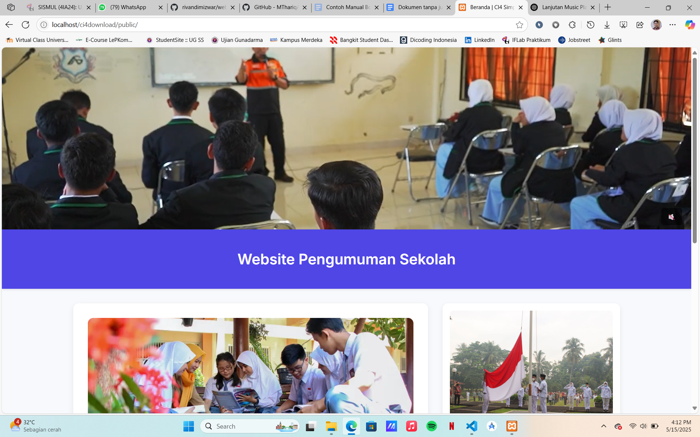
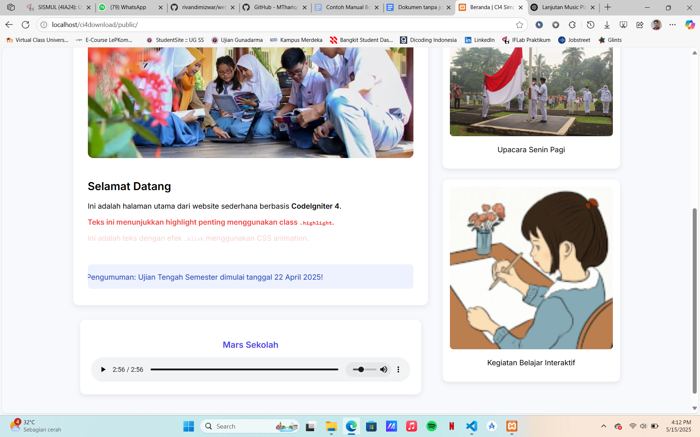

# Website Pengumuman Sekolah

Website ini merupakan aplikasi web sederhana berbasis **CodeIgniter 4** yang digunakan sebagai media penyampaian informasi atau pengumuman resmi dari pihak sekolah kepada siswa, guru, maupun orang tua.

## 📌 Deskripsi

Website Pengumuman Sekolah dikembangkan untuk memudahkan pihak sekolah dalam menyampaikan informasi seperti kegiatan sekolah, jadwal, pengumuman penting, serta profil sekolah secara digital. Halaman utama menampilkan video profil sekolah, banner informasi, serta pengumuman penting dengan desain yang responsif dan ramah pengguna.

Beberapa fitur utama:
- 🎞️ Tampilan video profil sekolah (autoplay)
- 📢 Pengumuman dengan penekanan (highlight)
- 📸 Gambar kegiatan sekolah
- 🎵 Audio profil sekolah

Website ini dibangun menggunakan framework **CodeIgniter 4** dengan struktur MVC (Model-View-Controller) dan dapat dijalankan secara lokal menggunakan XAMPP dengan Apache Server.

## Screenshot



## 🧰 Teknologi yang Digunakan
- PHP 8+
- CodeIgniter 4
- HTML5, CSS3
- XAMPP (Apache, MySQL)

## ⚙️ Cara Menjalankan Website
1. Pastikan XAMPP telah terinstal di komputer Anda dan Apache sudah dapat dijalankan.
2. Buka terminal atau command prompt, lalu clone repository ini:
   ```bash
   git clone https://github.com/rivandimizwar/website-pengumuman-sekolah.git
3. Pindahkan folder hasil clone (website-pengumuman-sekolah) ke dalam direktori htdocs milik XAMPP
4. Buka XAMPP Control Panel, lalu klik Start pada modul Apache
5. Buka browser dan akses alamat berikut:
   http://localhost/website-pengumuman-sekolah/public
6. Website akan langsung tampil dengan halaman utama berisi video profil, gambar kegiatan, serta pengumuman penting.
